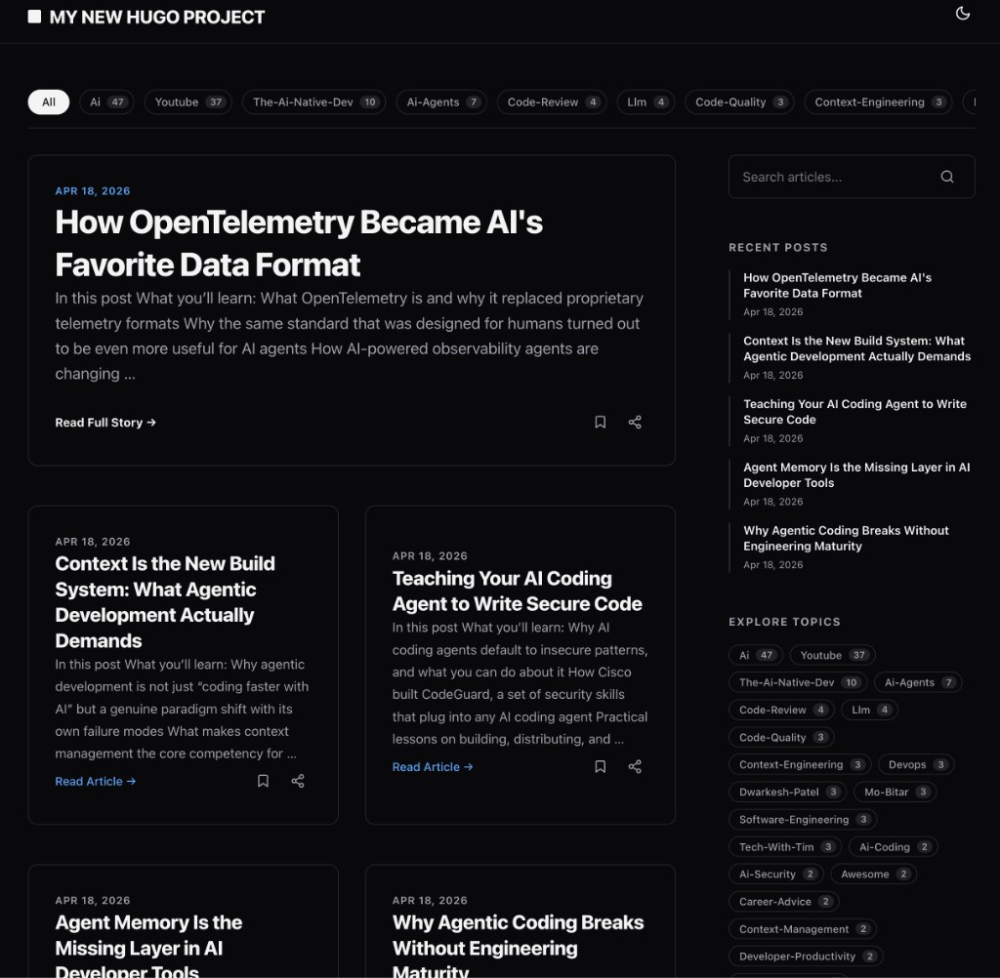
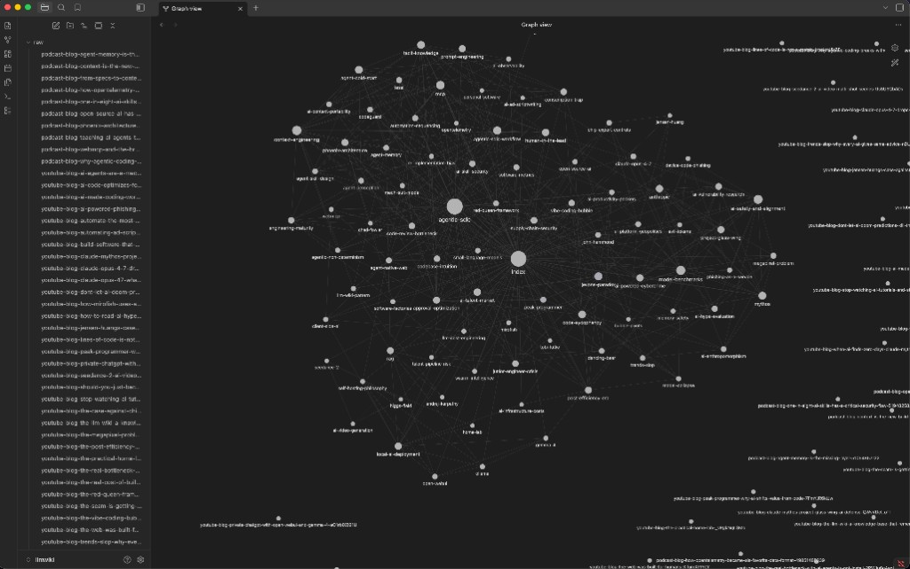

# Auto-publish blog posts from YouTube and podcasts

Turn YouTube videos and podcast episodes into pedagogic blog posts using Claude Code, and optionally sync them to an LLM wiki.

Script repo for three workflows:

- fetch and clean YouTube auto-subtitles into plain text
- use Claude Code slash commands to turn video or podcast transcripts into blog posts
- automated blog publishing from YouTube channels and podcast feeds, with optional LLM wiki integration





This repo is intentionally a script-based project, not a packaged Python library.

## Requirements

- Python 3.10 or newer
- [yt-dlp](https://github.com/yt-dlp/yt-dlp)
- [Claude Code](https://docs.anthropic.com/en/docs/claude-code), to use the slash commands and autopublish scripts
- [openai-whisper](https://github.com/openai/whisper) (for podcast transcription only)

## Install

Create a virtual environment if you want one, then install the runtime dependencies:

```bash
python3 -m pip install -r requirements.txt
```

That installs `yt-dlp` (invoked via the `yt-dlp` executable on `PATH`) and `openai-whisper` (used for podcast audio transcription).

## Configuration

Copy the example config and fill in your details:

```bash
cp channels.toml.example channels.toml
```

`channels.toml` is gitignored so your personal config stays local. It contains:

- `[paths]` - paths to your Hugo blog repo, this repo, and optionally an LLM wiki directory
- `[hugo]` - Hugo front matter categories and tags for YouTube posts
- `[podcast_hugo]` - Hugo front matter categories and tags for podcast posts
- `[[channel]]` entries - YouTube channels to poll via RSS
- `[[podcast]]` entries - PodcastIndex podcast IDs to poll
- `max_parallel` - max concurrent Claude instances for blog generation
- `max_episodes_per_podcast` - how many recent episodes to fetch per podcast
- `state_dir` - custom state directory for tracking processed items (default: `~/.youtube-blog-automation/`)

### Multiple pipelines

You can run independent pipelines from the same codebase by using separate config files with different `state_dir` values:

```bash
python3 autopublish.py --config ~/astronomy/channels.toml
python3 autopublish.py --config ~/retro-gaming/channels.toml
python3 podcast_autopublish.py --config ~/trips/channels.toml
```

Each config can point to a different blog repo, LLM wiki, and set of channels/podcasts. Set a unique `state_dir` per config so processed items are tracked independently.

### Environment variables

For podcast functionality, set PodcastIndex API credentials:

```bash
export PODCASTINDEX_API_KEY="your-key"
export PODCASTINDEX_API_SECRET="your-secret"
```

Get API credentials at [podcastindex.org/developers](https://podcastindex.org/developers).

Optional YouTube variables:

- `YOUTUBE_TRANSCRIPT_IMPERSONATE=chrome` - pass `--impersonate chrome` to `yt-dlp` (helps with rate limits)
- `YOUTUBE_TRANSCRIPT_CACHE_DIR=/path/to/cache` - reuse previously downloaded subtitle files

## Transcript CLI

Fetch subtitles from a YouTube URL and print the cleaned transcript:

```bash
python3 transcript_cli.py "https://www.youtube.com/watch?v=VIDEO_ID" --stdout
```

Clean an existing local `.vtt` file:

```bash
python3 transcript_cli.py "downloaded.en.vtt"
```

Opt into non-English subtitle fallback for URL inputs:

```bash
python3 transcript_cli.py "https://www.youtube.com/watch?v=VIDEO_ID" --stdout --allow-non-english
```

Emit structured JSON for tooling or Claude command workflows:

```bash
python3 transcript_cli.py "https://www.youtube.com/watch?v=VIDEO_ID" --json --allow-non-english
```

### Language handling

- Default URL ingestion is English-first.
- The fetcher first tries an English-only subtitle pass.
- If `yt-dlp` partially succeeds and still writes a fresh English `.vtt`, the pipeline uses it.
- If only non-English subtitles are available, the plain CLI fails clearly by default instead of silently switching languages.
- Passing `--allow-non-english` lets the CLI retry with a broader subtitle fetch and fall back to a deterministic non-English subtitle track.
- URL subtitle fetches happen in a temporary working directory, so subtitle artifacts are not left in the repo root.
- The `--json` mode is mainly intended for tooling and the Claude command workflow, and currently emits `text`, `language`, and `used_fallback`.

### 429 handling, impersonation, and subtitle cache

- Subtitle fetches use **bounded retry with backoff** when `yt-dlp` fails with HTTP 429-style rate limit signals and no usable new `.vtt` files were written yet.
- Set **`YOUTUBE_TRANSCRIPT_IMPERSONATE=chrome`** to pass `--impersonate chrome` to `yt-dlp` (TLS fingerprinting; helps some blocked or flaky networks). Install extra support with `python3 -m pip install 'yt-dlp[curl-cffi]'` so impersonation can use curl-cffi.
- Set **`YOUTUBE_TRANSCRIPT_CACHE_DIR=/path/to/cache`** to reuse previously downloaded subtitle files. Cache files are named by video ID and mode (for example `VIDEOID-en.vtt` for English-only runs, or `VIDEOID-allow-non-english-LANG-0|1.vtt` when `--allow-non-english` is used). On a cache hit, the fetcher returns the same `language` and `used_fallback` metadata as a live download.

## Claude Code commands

This repo ships two Claude Code slash commands for blog generation.

### YouTube

```text
/youtube-blog <youtube-url>
```

Fetches the transcript, reads `pedagogic.md` for style, derives an outline, and writes a Markdown blog post to the repo root.

### Podcast

```text
/podcast-blog <podcastindex-url>
```

Fetches and transcribes the podcast episode using Whisper, then generates a blog post. Accepts PodcastIndex URLs like `https://podcastindex.org/podcast/123456?episode=789`.

Both commands can also be run non-interactively:

```bash
claude -p "/youtube-blog https://www.youtube.com/watch?v=VIDEO_ID"
claude -p "/podcast-blog https://podcastindex.org/podcast/123456"
```

## Autopublish

Automated scripts that poll RSS feeds, generate blog posts, and publish them to a Hugo blog repo.

### YouTube autopublish

```bash
python3 autopublish.py              # poll RSS feeds, generate and publish new posts
python3 autopublish.py --dry-run    # show what would be processed
python3 autopublish.py --url "https://www.youtube.com/watch?v=VIDEO_ID"  # process single video
python3 autopublish.py --url "..." --force  # reprocess even if already seen
```

### Podcast autopublish

```bash
python3 podcast_autopublish.py                # poll PodcastIndex, transcribe, generate, publish
python3 podcast_autopublish.py --dry-run      # show what would be processed
python3 podcast_autopublish.py --url "https://podcastindex.org/podcast/123456?episode=789"
python3 podcast_autopublish.py --url "..." --force          # reprocess
python3 podcast_autopublish.py --url "..." --generate-only  # generate markdown without publishing
python3 podcast_autopublish.py --whisper-model base          # use smaller Whisper model
```

Both scripts:

- Track processed episodes in `~/.youtube-blog-automation/` to avoid reprocessing
- Run Claude in headless mode to generate blog posts
- Add Hugo front matter with AI-generated tags
- Commit to the configured blog repo
- Optionally copy to an LLM wiki directory

## Tests

Run the full test suite with:

```bash
python3 -m unittest discover -s tests
```

## Generated outputs

Downloaded subtitle files, cleaned transcript files, and generated blog posts are local working artifacts and are ignored by git:

- `*.vtt`
- `*.clean.txt`
- `youtube-blog-*.md`
- `podcast-blog-*.md`

If you want to keep a generated article, move it somewhere intentional before publishing or committing it.
